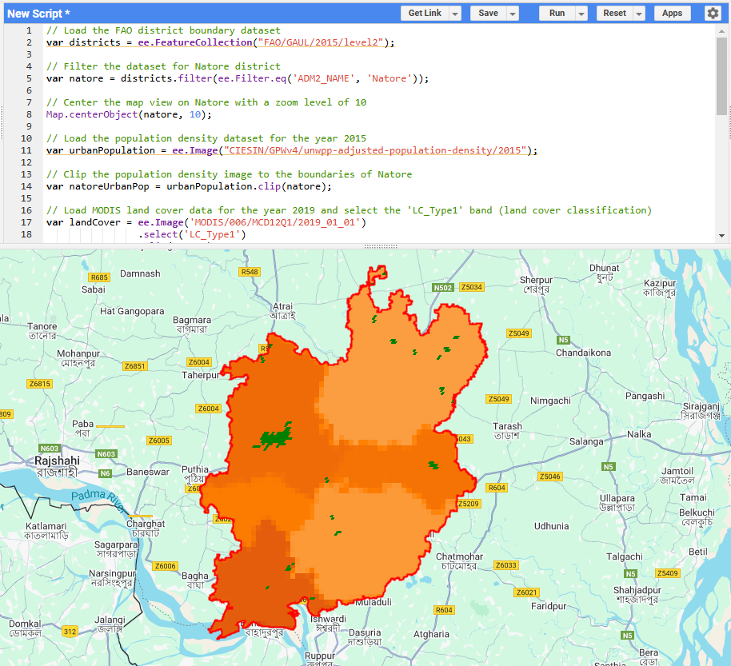
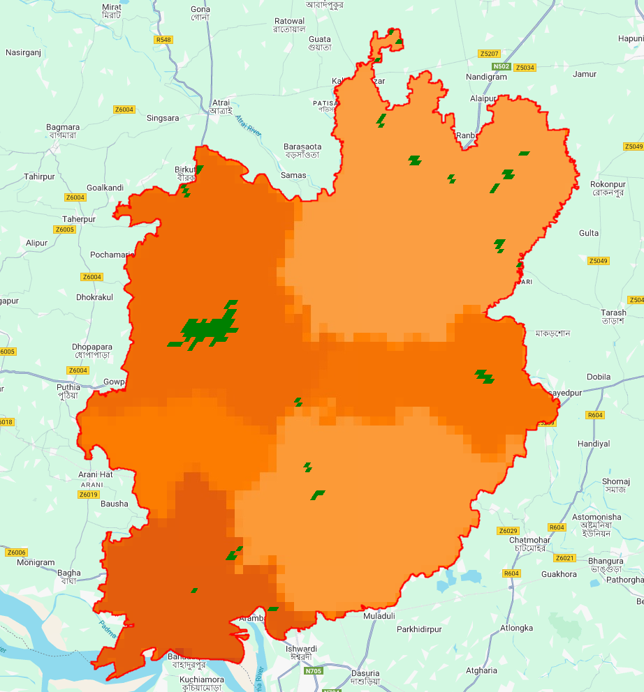

## Urbanization and Infrastructure Analysis for Natore District

## Overview
This project explores the urbanization trends and infrastructure patterns in **Natore District**, Bangladesh, using satellite-based geospatial data. The goal is to understand how population density and urban expansion impact the region, which can assist urban planning and development.

## Datasets Used
- **FAO GAUL 2015 District Boundary Data**: Provides boundaries for various administrative regions worldwide, including Natore District.
- **CIESIN 2015 Population Density Dataset**: Contains population density data to identify areas of high population concentration.
- **MODIS 2019 Land Cover Data**: Offers classification of land cover types, with urban areas represented by Class 13.

## Methodology
1. **District Boundary**: The FAO district boundary dataset was used to isolate Natore District from a global feature collection.
2. **Population Density**: The CIESIN population density data for 2015 was clipped to the boundaries of Natore District to visualize population distribution.
3. **Urban Areas**: The MODIS 2019 land cover dataset was processed to identify urban areas (Class 13) in the district, enabling an analysis of urban expansion.

## Key Insights
- **Urbanization**: The urban areas in Natore are identified through the land cover classification, helping to visualize urban growth.
- **Population Density**: Areas with higher population density are visible, highlighting regions that may require additional infrastructure.
- **Planning**: This analysis can support decisions in urban planning, resource distribution, and sustainable development.

## Visualizations
The analysis results are visualized using a custom color palette:
- **Population Density**: A color gradient from light blue (low density) to dark red (high density).
- **Urban Areas**: Urban regions are marked in green, distinguishing them from rural areas.

## Technologies Used
- **Google Earth Engine**: For processing and analyzing satellite data.
- **JavaScript API**: For manipulating and displaying geospatial data.
- **Leaflet/Google Maps**: For visualizing results on interactive maps.

### Population Density Visualization

This map highlights areas with varying population densities, helping to identify regions of higher concentration.

### Urbanization Patterns

